<picture>
  <source media="(prefers-color-scheme: dark)" srcset="assets/banner-dark.svg">
  <source media="(prefers-color-scheme: light)" srcset="assets/banner-light.svg">
  
</picture>

### Open source

- **[SoloMD](https://github.com/zhitongblog/solomd)** — requested Spanish (Hunspell) dictionary support ([issue #246](https://github.com/zhitongblog/solomd/issues/246)) and helped verify the fix, shipped in v4.14.0.
